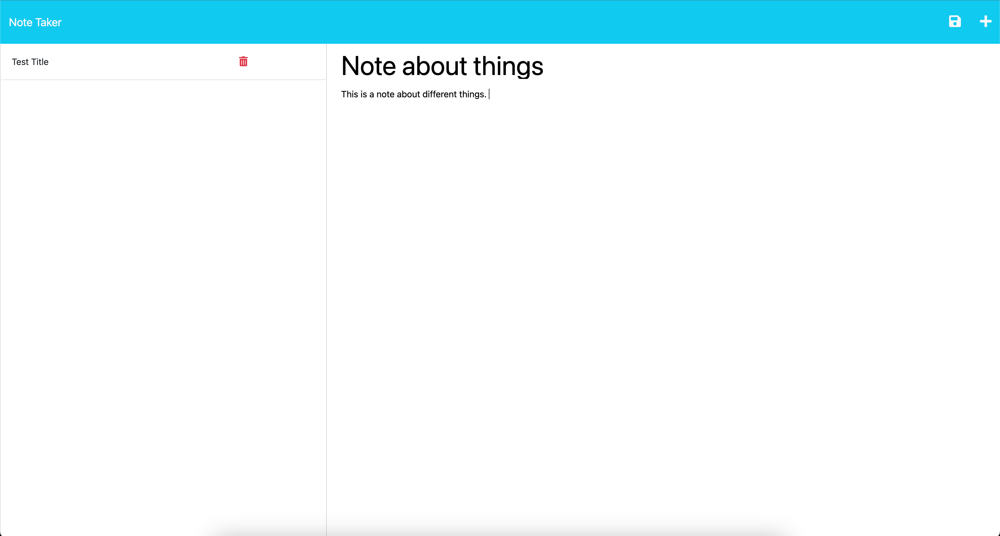
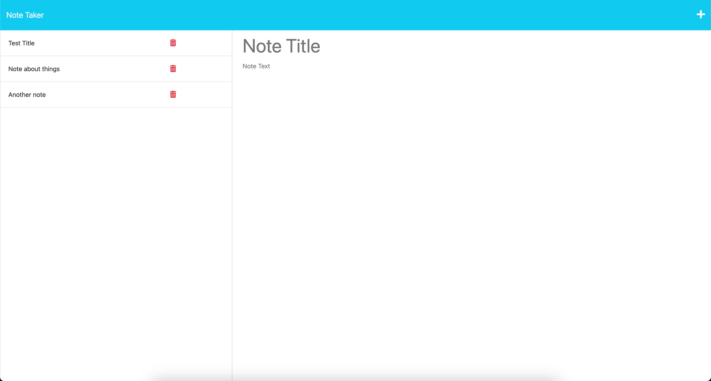
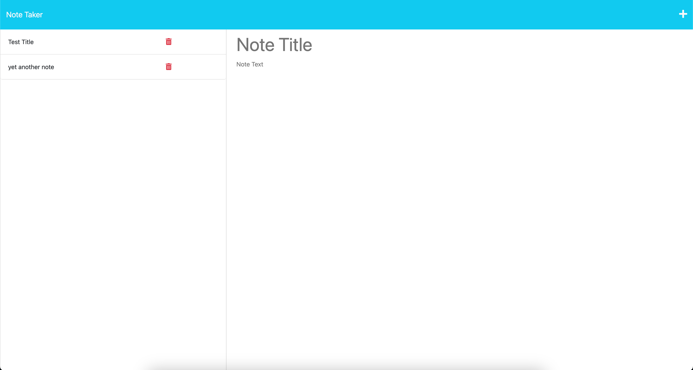

# Note Taker Epp Express JS

This is a simple note taking application that has a working back end server using express.js to power the back-end code. This application is also been deployed to Heroku so it has a working puslished live site. This homework was challenging, but it really helped me learn about the concepts of full-stack programming and gave me valuable knowsledge about the back-end side of programming. 

## Live Links

Here's the [Heroku Live Site!]()